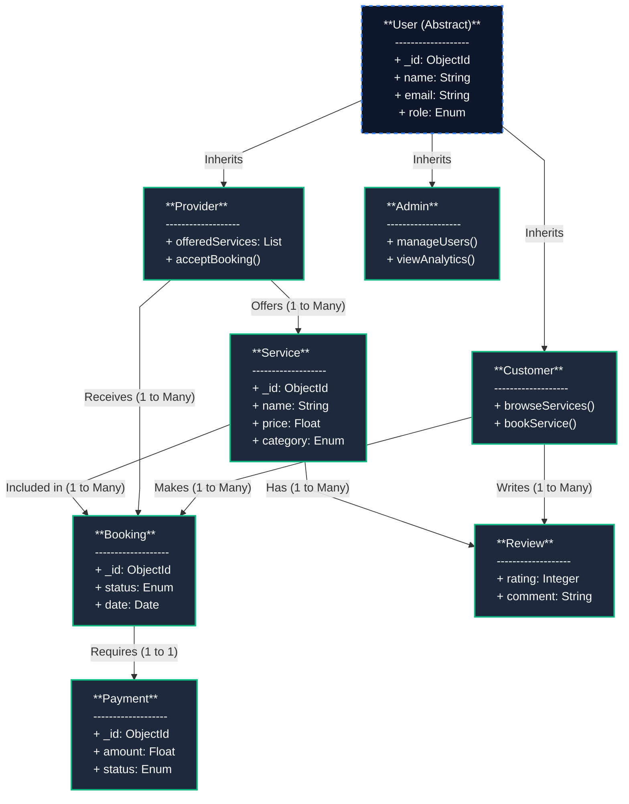

# QuickServe Straight-Arrow UML Diagram

This diagram uses a strictly linear flowchart layout to ensure all relationship arrows are perfectly straight, while mapping out the core entities and relationships.

