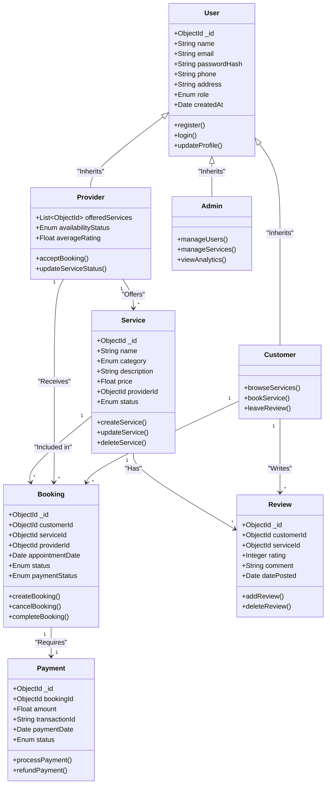

# QuickServe UML Class Diagram

This UML diagram represents the core architecture of the QuickServe application, illustrating the relationships between Users, Services, Bookings, Payments, and Reviews.

